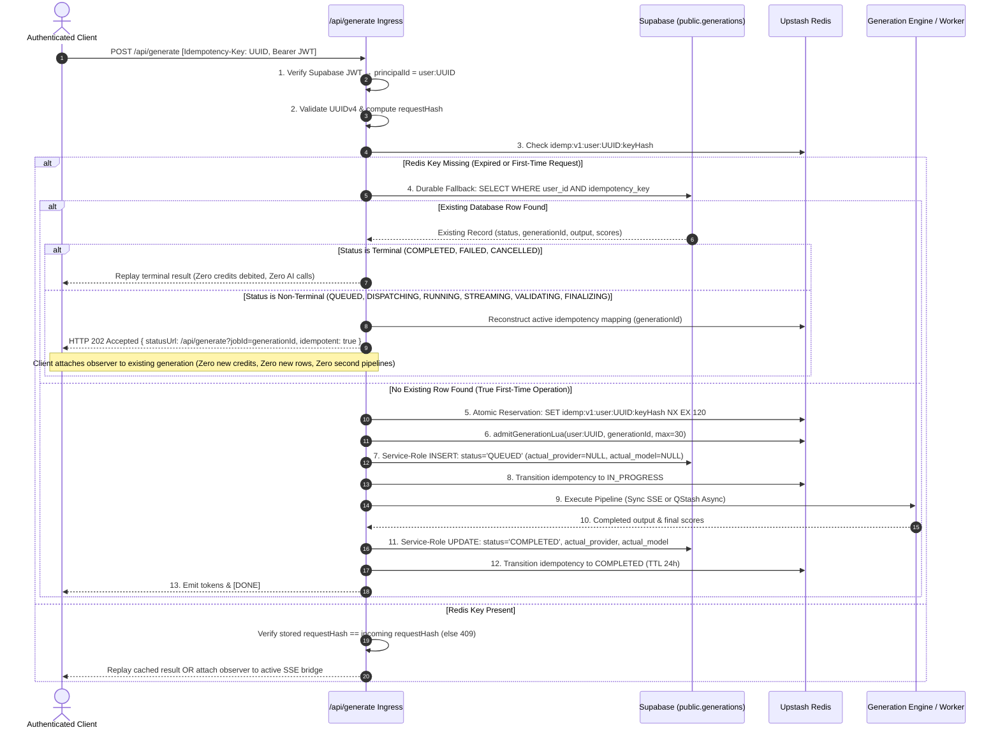
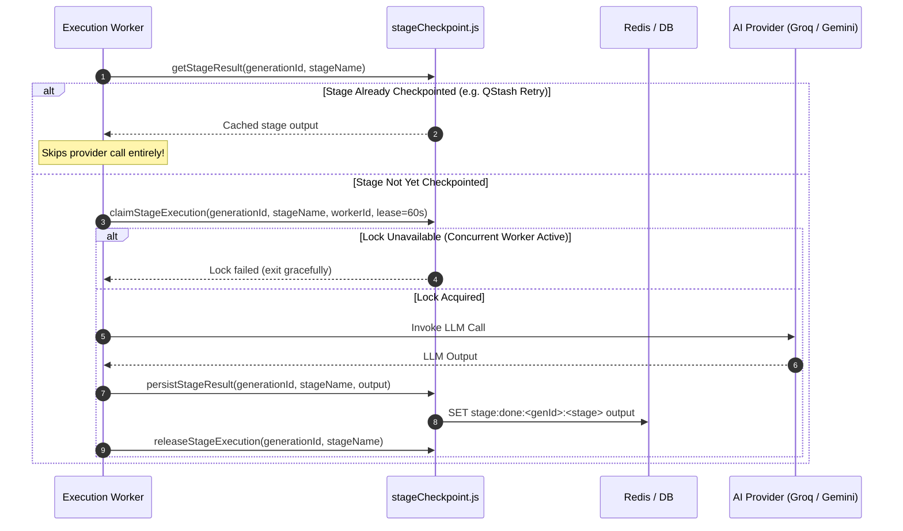

# PenShift Final Corrected Implementation Plan (Revision 9)

```text
STATUS: PLAN ONLY — NO CODE OR REPOSITORY FILES HAVE BEEN MODIFIED.
Awaiting explicit user authorization prior to executing any phase.
```

---

## 1. Architectural Statement & Final Execution Guarantees

> **Architectural Guarantee Statement:**  
> PenShift provides at-most-one concurrent execution owner per generation and durable stage replay protection.  
>  
> Because external LLM providers do not provide a universal exactly-once transaction spanning the provider call and PenShift's durable checkpoint write, a crash can occur after provider success but before checkpoint persistence. In that narrow boundary, a provider call may be retried. The architecture therefore guarantees deterministic generation-level recovery and prevents duplicate completed generations, but does not falsely claim universal exactly-once provider invocation.

### Final Execution Invariants

```text
ONE active execution owner at a time
        +
ONE durable generation lifecycle
        +
ONE durable checkpoint per completed stage
        +
terminal-state replay
        +
NO duplicate completed generation
```

### Identity Hierarchy

```text
PenShift Idempotency-Key
        ↓
generationId
        ↓
generation lifecycle
        ↓
stage checkpoints (<generationId>:<stageName>)
        ↓
QStash Deduplication-Id
```

---

## 2. Final Authenticated Lifecycle (Including Non-Terminal Recovery)



---

## 3. Final Guest Lifecycle & Secondary Abuse Control

Guest generations are strictly segregated from `public.generations` to avoid foreign-key violations against `auth.users`, with dual-tier abuse protection.

```mermaid
sequenceDiagram
    autonumber
    actor Guest as Guest Client
    participant Gateway as /api/generate Ingress
    participant CookieMgr as Guest Cookie Manager
    participant Abuse as Coarse IP / Network Limiter
    participant Redis as Upstash Redis
    participant Engine as AI Generation Pipeline

    Guest->>Gateway: POST /api/generate [Idempotency-Key: UUID, __Host-penshift-guest Cookie]

    alt Cookie Missing or HMAC Invalid
        Gateway->>Abuse: Check Coarse IP Bucket (max 15 cookie issuances/hr)
        alt IP Abuse Triggered
            Abuse-->>Gateway: Reject 429 Too Many Requests
            Gateway-->>Guest: 429 Rate limit exceeded
        else IP OK
            Gateway->>CookieMgr: Issue signed __Host-penshift-guest cookie (HttpOnly; Secure; Path=/; SameSite=Lax)
        end
    end

    Gateway->>Gateway: Resolve principalId = guest:UUID from verified cookie
    Gateway->>Gateway: Validate UUIDv4 & compute requestHash
    Gateway->>Redis: Check idemp:v1:guest:UUID:keyHash

    alt Redis Active Key Present (0 to 24 Hours)
        Gateway->>Gateway: Verify stored requestHash == incoming requestHash (else 409)
        Gateway-->>Guest: Replay cached result from Redis OR attach observer to active SSE bridge
    else Redis Active Key Missing
        Gateway->>Redis: Check Tombstone: idemp:tombstone:v1:guest:UUID:keyHash
        alt Tombstone Exists (24 Hours to 30 Days)
            Gateway-->>Guest: HTTP 400 IDEMPOTENCY_KEY_EXPIRED (Zero AI calls, Zero credits debited)
        else Tombstone Missing (>30 Days or Never Used)
            Gateway->>Redis: Atomic Reservation: SET idemp:v1:guest:UUID:keyHash NX EX 120
            Gateway->>Redis: admitGenerationLua(guest:UUID, generationId, max=5)
            Gateway->>Redis: Store Ephemeral State: job:guest:UUID:generationId:state (status='QUEUED')
            Gateway->>Redis: Transition idempotency to IN_PROGRESS
            Gateway->>Engine: Execute Pipeline (Sync SSE or QStash Async)
            Engine-->>Gateway: Completed output & final scores
            Gateway->>Redis: Store completed output in Redis (TTL 24h)
            Gateway->>Redis: SET idemp:tombstone:v1:guest:UUID:keyHash 1 EX 2592000 (30 Days)
            Gateway->>Redis: Transition idempotency to COMPLETED (TTL 24h)
            Gateway-->>Guest: Stream tokens & [DONE]
        end
    end
```

### Secondary Guest Abuse Control Specification
- **Primary Identity (Quota):** Server-issued `__Host-penshift-guest` signed cookie (`HttpOnly; Secure; Path=/; SameSite=Lax`, **no Domain attribute** per RFC 6265bis).
- **Secondary Identity (Abuse Guard):** Conservative edge rate limiter `rl_guest_cookie_issuance_<clientIp>` (max 15 session issuances per hour). Prevents scrapers from continuously deleting cookies to reset guest quotas.
- **Strict Invariants:** IP address is never used as an idempotency identity, never replaces the signed guest cookie, and is never stored in generation output records.

---

## 4. Final Idempotency Lifecycle & Scoped Replay Windows

### 4.1 Replay Window Scoping
- **Authenticated Replay Window:** Permanent. Protected by Redis for 24 hours, and durably backed by Supabase `(user_id, idempotency_key)` thereafter.
- **Guest Replay Window:** 24 hours active retention, followed by a 30-day tombstone window.
  - **0–24 Hours:** Replays the original generation deterministically.
  - **24 Hours–30 Days:** Active record has expired, but tombstone exists. Rejects reuse immediately with `HTTP 400 IDEMPOTENCY_KEY_EXPIRED`. Does not start a new generation.
  - **After 30 Days:** Tombstone expires. Key becomes indistinguishable from a never-used key.

### 4.2 Authenticated Redis Expiry: Non-Terminal vs. Terminal Recovery
When Redis active record is missing, ingress executes a durable fallback query:
```sql
SELECT id, status, output_text, scores, metadata, actual_provider, actual_model
FROM public.generations
WHERE user_id = $1 AND idempotency_key = $2;
```
- **If Row is Terminal (`COMPLETED`, `FAILED`, `CANCELLED`):**
  Replay the terminal result. Zero credits debited. Zero AI calls.
- **If Row is Non-Terminal (`QUEUED`, `DISPATCHING`, `RUNNING`, `STREAMING`, `VALIDATING`, `FINALIZING`):**
  - Reconstruct active idempotency mapping in Redis.
  - Connect requester to `/api/generate?jobId=<existing-generationId>`.
  - **DO NOT** allocate a new `generationId`.
  - **DO NOT** debit another credit.
  - **DO NOT** insert another Supabase row.
  - **DO NOT** start a second AI pipeline.
  - If `QUEUED` or `DISPATCHING` without confirmed dispatch, the job safely enters the reconciliation/re-dispatch path under the **same** `generationId`.
  - If already executing, the requester simply observes the ongoing execution.

---

## 5. Final Credit Admission Lifecycle

Credit admission is atomically bound to the identity tuple `(principalId, generationId)`.

### Lua Script Contract: `admitGenerationLua`
```lua
-- admitGenerationLua
-- KEYS[1]: rate_limit_key (rl_user_generation:<principalId>)
-- KEYS[2]: credit_admission_key (credit:admitted:<principalId>:<generationId>)
-- ARGV[1]: window_ms (60000)
-- ARGV[2]: max_credits (30 for auth, 5 for guest)
-- ARGV[3]: now_ms
-- ARGV[4]: admission_ttl (86400)

-- 1. Idempotency Check: Has this exact generationId already been debited?
if redis.call("EXISTS", KEYS[2]) == 1 then
    return {1, 1} -- Admitted (replayed): Zero credit deducted
end

-- 2. Sliding Window Quota Check
redis.call("ZREMRANGEBYSCORE", KEYS[1], "-inf", ARGV[3] - ARGV[1])
local current_usage = redis.call("ZCARD", KEYS[1])

if current_usage >= tonumber(ARGV[2]) then
    return {0, 0} -- Rejected: Quota limit exceeded
end

-- 3. Atomically Commit Credit
redis.call("ZADD", KEYS[1], ARGV[3], ARGV[3] .. "-" .. math.random(100000, 999999))
redis.call("PEXPIRE", KEYS[1], ARGV[1])

-- 4. Mark Generation Admission Identity
redis.call("SET", KEYS[2], "1", "EX", tonumber(ARGV[4]))
return {1, 0} -- Admitted (fresh debit)
```

### Rate Limiting Hierarchy
- **`rl_user_generation`:** Enforces user generation credits (Authenticated: 30 req/min, Guest: 5 req/min). Debited once per logical Humanize/Blog/Affiliate action.
- **`rl_user_scoring`:** Enforces standalone scoring limits (Authenticated: 60 req/min, Guest: 15 req/min) strictly when invoked directly via `/score` or manual "Check AI Score".
- **Internal Scoring Budget:** Scoring performed internally during a single Humanizer generation consumes zero user credits and makes no separate browser HTTP request; it executes within server-side stage budgets.

---

## 6. Final Stage-Checkpoint Lifecycle

Module: [`api/_lib/ai/stageCheckpoint.js`](file:///Users/satyajishu/Downloads/penshift-v8/api/_lib/ai/stageCheckpoint.js)

To prevent duplicate LLM calls during worker retries or transport reconnections, the pipeline breaks generation into durable checkpoints:

```text
Generation Start
       ↓
Stage 1: INPUT_SCORE Checkpoint
       ↓
Stage 2: FACT_LOCK Checkpoint
       ↓
Stage 3: DRAFT Checkpoint
       ↓
Stage 4: CRITIQUE Checkpoint
       ↓
Stage 5: REFINE Checkpoint
       ↓
Stage 6: OUTPUT_SCORE Checkpoint
       ↓
Final Durable Generation Result
```

### Checkpoint Identity & Execution Contract
- **Checkpoint Key:** `<generationId>:<stageName>`
- **Stages:** `INPUT_SCORE`, `FACT_LOCK`, `DRAFT`, `CRITIQUE`, `REFINE`, `OUTPUT_SCORE`.
- **Durable Storage:**
  - Authenticated: Ephemeral progress stored in Redis (`stage:done:<genId>:<stage>`); final result written to Supabase `generations`.
  - Guest: Stored in Redis (`stage:done:guest:<sessionId>:<genId>:<stage>`) with 24-hour TTL.

### Per-Stage Execution Flow


### Recovery Behaviors
- **Stage checkpoint exists:** QStash retry reads cached result and skips the LLM call for that stage.
- **Worker crashes after stage completion:** Retry resumes seamlessly from the next uncompleted stage.
- **Worker crashes after provider call but before checkpoint write:** Provider call may be retried. The overall generation remains deterministic and at most one completed generation is finalized.

---

## 7. Final QStash Dispatch, Retry & Recovery Lifecycle

```mermaid
flowchart TD
    Ingress[/api/generate Ingress] -->|Publish Webhook| QStashCloud[(Upstash QStash)]

    subgraph QStashPublishDetails [Publish Request Details]
        QStashCloud -.->|Target URL: PENSHIFT_QSTASH_WORKER_URL| WorkerURL[Fixed Canonical Destination]
        QStashCloud -.->|Upstash-Deduplication-Id: generationId| Dedupe[10-min Deduplication]
        QStashCloud -.->|Upstash-Retries: 2| Retries[1 Delivery + 2 Retries = 3 Total]
        QStashCloud -.->|Upstash-Timeout: 290s| Timeout[290s Budget < 300s Container]
    end

    QStashCloud -->|HTTP 200 + messageId| IngressSuccess[Dispatch Confirmed]
    QStashCloud -->|HTTP 202 + deduplicated: true| IngressDedupe[Deduplicated Dispatch Confirmed]
    QStashCloud -.->|Other Status Codes| IngressError[Error / Recovery Path]

    QStashCloud -->|Durable Webhook with Upstash-Signature JWT| WorkerEndpoint[/api/_internal/worker/generation]

    subgraph WorkerVerification [Worker Cryptographic Verification]
        WorkerEndpoint --> ReadRaw[1. Read Raw Request Body Buffer]
        ReadRaw --> GetSig[2. Extract Upstash-Signature & upstash-region Headers]
        GetSig --> ReceiverVerify[3. Receiver.verify: rawBody, signature, canonicalUrl, upstashRegion]
        ReceiverVerify -->|Invalid / Forged| Reject401[HTTP 401 Unauthorized - Exit]
        ReceiverVerify -->|Valid| ExecLock[4. Check Terminal State & Claim Lock]
    end
```

### 7.1 QStash Publish Contract & Success Handling
- Ingress calls QStash API:
  ```http
  POST https://qstash.upstash.io/v2/publish/https://penshift.com/api/_internal/worker/generation
  Authorization: Bearer <QSTASH_TOKEN>
  Upstash-Deduplication-Id: <generationId>
  Upstash-Retries: 2
  Upstash-Timeout: 290s
  Content-Type: application/json
  ```
- **Official Publish Outcomes:**
  - `HTTP 200` + valid `messageId`: Normal successful publish.
  - `HTTP 202` + valid `messageId` + `deduplicated: true`: Successful deduplicated publish (QStash deduplicated within its 10-minute window).
  - Both `200` and `202` (with valid `messageId`) are treated as **successful dispatch outcomes**.
  - Any unexpected status code: Routed to error logging and reconciliation recovery.
- **Execution Margins:** `Upstash-Retries: 2` represents 1 initial delivery + 2 retries = 3 total delivery attempts. `Upstash-Timeout: 290s` stays within the Vercel 300s worker container limit.

### 7.2 Fixed Canonical Worker Verification: `/api/_internal/worker/generation.js`
- **Verification Rule:** Verification uses the fixed canonical destination URL (`process.env.PENSHIFT_QSTASH_WORKER_URL || 'https://penshift.com/api/_internal/worker/generation'`), raw request body buffer, and `upstashRegion` parameter.
- **Implementation:**
  ```javascript
  import { Receiver } from '@upstash/qstash';

  const receiver = new Receiver({
    currentSigningKey: process.env.QSTASH_CURRENT_SIGNING_KEY,
    nextSigningKey: process.env.QSTASH_NEXT_SIGNING_KEY,
  });

  const CANONICAL_WORKER_URL = process.env.PENSHIFT_QSTASH_WORKER_URL || 'https://penshift.com/api/_internal/worker/generation';

  export const config = { api: { bodyParser: false } };

  export default async function handler(req, res) {
    if (req.method !== 'POST') return res.status(405).end();

    const signature = req.headers['upstash-signature'];
    if (!signature) return res.status(401).json({ error: 'MISSING_SIGNATURE' });

    const rawBody = await getRawBody(req);
    const upstashRegion = req.headers['upstash-region'];

    const isValid = await receiver.verify({
      signature,
      body: rawBody.toString('utf-8'),
      url: CANONICAL_WORKER_URL,
      upstashRegion,
    }).catch(() => false);

    if (!isValid) {
      return res.status(401).json({ error: 'INVALID_QSTASH_SIGNATURE' });
    }

    // Proceed to worker execution lock and stage checkpoints...
  }
  ```

### 7.3 Worker Execution Lock & Terminal-State Verification
1. Authoritative check: If generation is already `COMPLETED`, `FAILED`, or `CANCELLED`, return `HTTP 200 OK` immediately without any LLM call.
2. Claim execution lock: `SET job:lock:<generationId> <workerId> NX EX 360`. If held by another active worker, return `HTTP 200 OK`.
3. Re-verify authoritative status after lock acquisition.
4. Execute uncompleted stages via `stageCheckpoint.js`.

### 7.4 Terminal-State-Aware Reconciler: `/api/_internal/reconcile.js`
- Authenticated via `Authorization: Bearer <CRON_SECRET>`.
- Scheduled via `vercel.json` crons (`*/5 * * * *`).
- Queries jobs in `status IN ('QUEUED', 'DISPATCHING')` older than 2 minutes.
- **Safety Rule:** Re-checks authoritative state before re-dispatching. Never re-dispatches `COMPLETED`, `FAILED`, or `CANCELLED` jobs.
- If stranded job exceeds 15 minutes, atomically marks it `FAILED` only after confirming no worker holds the execution lock.

---

## 8. Final Authorization Model (SSE, Status, Cancellation)

A `generationId` is strictly an identifier, **never** an authorization credential.

### Endpoints
- `GET /api/generate?jobId=<generationId>` (SSE bridge and status polling)
- `POST /api/generate?action=cancel&jobId=<generationId>` (Cancellation)

### Authorization Rules
1. **Authenticated Requests:**
   - Must supply `Authorization: Bearer <Supabase JWT>`.
   - Resolves `authenticatedUser.id`.
   - Queries Supabase: `SELECT user_id FROM public.generations WHERE id = $1`.
   - If `generation.user_id !== authenticatedUser.id` or record does not exist: Return **`HTTP 404 Not Found`** (authorization-safe; does not leak record existence).
2. **Guest Requests:**
   - Must supply valid signed `__Host-penshift-guest` cookie.
   - Resolves `guestPrincipal` (`guest:<sessionId>`).
   - Reads Redis key: `job:guest:<sessionId>:<generationId>:state`.
   - If owner principal does not match or key does not exist: Return **`HTTP 404 Not Found`**.
3. **Cancellation Safety:**
   - Ownership verification **MUST** pass before `job:<generationId>:cancel = 1` is written.

---

## 9. Final Supabase Schema & Server-Authoritative RLS

The migration SQL is literally executable PostgreSQL syntax without any markdown escaping artifacts. Generated columns `provider` and `mode` are read-only and never included in backend `INSERT`, `UPDATE`, or `UPSERT` statements.

File: [`supabase/migrations/20261001000000_create_generations_table.sql`](file:///Users/satyajishu/Downloads/penshift-v8/supabase/migrations/20261001000000_create_generations_table.sql)

```sql
-- =============================================================================
-- Migration: 20261001000000_create_generations_table.sql
-- Description: Server-authoritative generations ledger with principal-scoped idempotency.
-- =============================================================================

CREATE TABLE IF NOT EXISTS public.generations (
    id UUID PRIMARY KEY DEFAULT gen_random_uuid(),
    user_id UUID NOT NULL REFERENCES auth.users(id) ON DELETE CASCADE,
    idempotency_key VARCHAR(128) NOT NULL,
    type VARCHAR(50) NOT NULL DEFAULT 'penshift_history',
    task VARCHAR(50) NOT NULL DEFAULT 'humanize',
    requested_mode VARCHAR(50) NOT NULL DEFAULT 'standard',
    requested_provider VARCHAR(50) NOT NULL DEFAULT 'auto',
    actual_provider VARCHAR(50),
    actual_model VARCHAR(100),
    input_text TEXT NOT NULL,
    output_text TEXT,
    input_word_count INTEGER DEFAULT 0,
    output_word_count INTEGER DEFAULT 0,
    scores JSONB DEFAULT '{}'::jsonb,
    metadata JSONB DEFAULT '{}'::jsonb,
    token_usage JSONB DEFAULT '{"promptTokens": 0, "completionTokens": 0, "totalTokens": 0}'::jsonb,
    data JSONB NOT NULL DEFAULT '{}'::jsonb,
    status VARCHAR(30) NOT NULL DEFAULT 'QUEUED',
    created_at TIMESTAMPTZ NOT NULL DEFAULT timezone('utc'::text, now()),
    updated_at TIMESTAMPTZ NOT NULL DEFAULT timezone('utc'::text, now()),

    -- Generated read-only columns for backward-compatibility with legacy frontend queries:
    provider VARCHAR(50) GENERATED ALWAYS AS (COALESCE(actual_provider, requested_provider)) STORED,
    mode VARCHAR(50) GENERATED ALWAYS AS (requested_mode) STORED,

    -- Completion integrity:
    CONSTRAINT chk_completed_provider_model CHECK (
        status != 'COMPLETED' OR (actual_provider IS NOT NULL AND actual_model IS NOT NULL)
    )
);

-- Performance Indexes
CREATE INDEX IF NOT EXISTS idx_generations_user_created 
    ON public.generations (user_id, created_at DESC);

CREATE INDEX IF NOT EXISTS idx_generations_user_type_created 
    ON public.generations (user_id, type, created_at DESC);

CREATE INDEX IF NOT EXISTS idx_generations_reconciliation 
    ON public.generations (status, created_at) 
    WHERE status IN ('QUEUED', 'DISPATCHING');

-- Principal-Scoped Idempotency Index
CREATE UNIQUE INDEX IF NOT EXISTS idx_generations_user_idempotency
    ON public.generations (user_id, idempotency_key);

-- Enable Row Level Security (RLS)
ALTER TABLE public.generations ENABLE ROW LEVEL SECURITY;

-- 1. SELECT: Authenticated users can view ONLY their own rows
CREATE POLICY "Users can view own generations" 
    ON public.generations 
    FOR SELECT 
    USING (auth.uid() = user_id);

-- 2. DELETE: Users can delete rows from their own history
CREATE POLICY "Users can delete own generations" 
    ON public.generations 
    FOR DELETE 
    USING (auth.uid() = user_id);

-- 3. REVOKE INSERT & UPDATE from browser clients
-- Generation records are created and updated EXCLUSIVELY by the backend service-role path.
REVOKE INSERT, UPDATE ON public.generations FROM anon, authenticated;

-- Automatic updated_at trigger
CREATE OR REPLACE FUNCTION public.handle_updated_at()
RETURNS TRIGGER AS $$
BEGIN
    NEW.updated_at = timezone('utc'::text, now());
    RETURN NEW;
END;
$$ LANGUAGE plpgsql;

DROP TRIGGER IF EXISTS trigger_generations_updated_at ON public.generations;
CREATE TRIGGER trigger_generations_updated_at
    BEFORE UPDATE ON public.generations
    FOR EACH ROW
    EXECUTE FUNCTION public.handle_updated_at();
```

---

## 10. Final Model Registry

File: [`api/_lib/ai/modelRegistry.js`](file:///Users/satyajishu/Downloads/penshift-v8/api/_lib/ai/modelRegistry.js)

```javascript
export const MODEL_REGISTRY = {
  // ═══════════════════════════════════ GROQ HOSTED MODELS ═══════════════════════════════════
  'openai/gpt-oss-120b': {
    provider: 'groq',
    providerModelId: 'openai/gpt-oss-120b',
    status: 'production',
    purpose: 'Drafting, forensic critique, human cadence synthesis, deep debate',
    fallbackPriority: 1,
    enabled: true,
    
    // Official Provider Physical Specifications:
    providerContextLimit: 131072,      // 128k physical context
    providerMaxOutputTokens: 65536,    // 64k physical output capacity
    supportsStreaming: true,
    supportsStructuredOutputs: true,

    // PenShift Configured Safety Budgets:
    defaultMaxOutputTokens: 4096,
    debateDraftMaxOutputTokens: 3000,
    refineMaxOutputTokens: 4096,
    defaultTemperature: 0.72,
    presencePenalty: 0.6,
  },

  'openai/gpt-oss-20b': {
    provider: 'groq',
    providerModelId: 'openai/gpt-oss-20b',
    status: 'production',
    purpose: 'High-throughput input scoring, fact lock extraction, structural blueprinting',
    fallbackPriority: 2,
    enabled: true,
    
    // Official Provider Physical Specifications:
    providerContextLimit: 131072,      // 128k physical context
    providerMaxOutputTokens: 65536,    // 64k physical output capacity
    supportsStreaming: true,
    supportsStructuredOutputs: true,

    // PenShift Configured Safety Budgets:
    defaultMaxOutputTokens: 2048,
    scoringMaxOutputTokens: 512,       // Strict budget for non-streaming JSON scoring
    factLockMaxOutputTokens: 1024,
    defaultTemperature: 0.2,           // Low temperature for analytical scoring
  },

  'qwen/qwen3.8-27b': {
    provider: 'groq',
    providerModelId: 'qwen/qwen3.8-27b',
    status: 'preview',
    purpose: 'Emergency fallback for drafting and critique (disabled by default)',
    fallbackPriority: 3,
    enabled: false,                    // Explicit preview flag — disabled by default

    // Official Provider Physical Specifications:
    providerContextLimit: 131072,
    providerMaxOutputTokens: 16384,
    supportsStreaming: true,
    supportsStructuredOutputs: true,

    // PenShift Configured Safety Budgets:
    defaultMaxOutputTokens: 3000,
    defaultTemperature: 0.7,
  },

  // ═══════════════════════════════════ GOOGLE GEMINI MODELS ═══════════════════════════════════
  'gemini-3.8-flash': {
    provider: 'gemini',
    providerModelId: 'gemini-3.8-flash',
    status: 'production',
    purpose: 'Primary Google drafting, long-form humanization, debate multi-stage fallback',
    fallbackPriority: 1,
    enabled: true,

    // Official Provider Physical Specifications:
    providerContextLimit: 1048576,     // 1,048,576 tokens physical context
    providerMaxOutputTokens: 65536,    // 65,536 tokens physical output capacity
    supportsStreaming: true,
    supportsStructuredOutputs: true,

    // PenShift Configured Safety Budgets:
    defaultMaxOutputTokens: 4096,
    defaultTemperature: 0.75,
    topP: 0.90,
    topK: 40,
  },

  'gemini-3.5-flash': {
    provider: 'gemini',
    providerModelId: 'gemini-3.5-flash',
    status: 'production',
    purpose: 'Resilient secondary fallback for drafting and text transformation',
    fallbackPriority: 2,
    enabled: true,

    // Official Provider Physical Specifications:
    providerContextLimit: 1048576,     // 1,048,576 tokens physical context
    providerMaxOutputTokens: 65536,    // 65,536 tokens physical output capacity
    supportsStreaming: true,
    supportsStructuredOutputs: true,

    // PenShift Configured Safety Budgets:
    defaultMaxOutputTokens: 4096,
    defaultTemperature: 0.75,
    topP: 0.90,
  },

  'gemini-3.5-flash-lite': {
    provider: 'gemini',
    providerModelId: 'gemini-3.5-flash-lite',
    status: 'production',
    purpose: 'Cost-optimized fast scoring, fact lock extraction, lightweight analysis',
    fallbackPriority: 3,
    enabled: true,

    // Official Provider Physical Specifications:
    providerContextLimit: 1048576,     // 1,048,576 tokens physical context
    providerMaxOutputTokens: 65536,    // 65,536 tokens physical output capacity
    supportsStreaming: true,
    supportsStructuredOutputs: true,

    // PenShift Configured Safety Budgets:
    defaultMaxOutputTokens: 2048,
    scoringMaxOutputTokens: 512,
    defaultTemperature: 0.1,
  }
};
```

---

## 11. Final List of Files to Modify / Create

| Action | File Path | Scope & Detailed Technical Purpose | UI Affected? | Priority |
| :--- | :--- | :--- | :---: | :---: |
| **CREATE** | [`api/_lib/ai/stageCheckpoint.js`](file:///Users/satyajishu/Downloads/penshift-v8/api/_lib/ai/stageCheckpoint.js) | Durable generation-stage checkpointing (`<generationId>:<stageName>`) and retry-safe stage execution ownership shared by synchronous and asynchronous paths. | **NO** | **P0** |
| **CREATE** | [`api/_lib/ai/modelRegistry.js`](file:///Users/satyajishu/Downloads/penshift-v8/api/_lib/ai/modelRegistry.js) | Centralized model registry distinguishing physical limits (131k/65k Groq, 1M/65k Gemini) from PenShift safety limits for Groq (`openai/gpt-oss-120b`, `openai/gpt-oss-20b`, `qwen/qwen3.8-27b`) and Google (`gemini-3.8-flash`, `gemini-3.5-flash`, `gemini-3.5-flash-lite`). | **NO** | **P0** |
| **CREATE** | [`api/_lib/ai/providers/BaseProvider.js`](file:///Users/satyajishu/Downloads/penshift-v8/api/_lib/ai/providers/BaseProvider.js) | Provider abstract interface declaring standard contracts for `generate()`, `stream()`, `score()`, and `healthCheck()`. | **NO** | **P0** |
| **CREATE** | [`api/_lib/ai/providers/GroqProvider.js`](file:///Users/satyajishu/Downloads/penshift-v8/api/_lib/ai/providers/GroqProvider.js) | Groq adapter targeting `openai/gpt-oss-120b` and `openai/gpt-oss-20b`. Enforces non-streaming JSON mode for scoring and raw SSE for rewriting. | **NO** | **P0** |
| **CREATE** | [`api/_lib/ai/providers/GeminiProvider.js`](file:///Users/satyajishu/Downloads/penshift-v8/api/_lib/ai/providers/GeminiProvider.js) | Google Gemini adapter targeting `gemini-3.8-flash`, `gemini-3.5-flash`, and `gemini-3.5-flash-lite`. | **NO** | **P0** |
| **CREATE** | [`api/_lib/ai/circuitBreaker.js`](file:///Users/satyajishu/Downloads/penshift-v8/api/_lib/ai/circuitBreaker.js) | Multi-key rotation, exponential backoff cooldowns, failure decay, and distributed Redis cooldown synchronization. | **NO** | **P0** |
| **CREATE** | [`api/_lib/ai/capabilityMatcher.js`](file:///Users/satyajishu/Downloads/penshift-v8/api/_lib/ai/capabilityMatcher.js) | Selects optimal provider and model based on task, mode, and input length. Populates `actual_provider` and `actual_model` upon selection. | **NO** | **P0** |
| **CREATE** | [`api/_lib/ai/generationLifecycle.js`](file:///Users/satyajishu/Downloads/penshift-v8/api/_lib/ai/generationLifecycle.js) | Manages `generationId`, state machine transitions (`QUEUED`, `RUNNING`, `STREAMING`, `VALIDATING`, `FINALIZING`, `COMPLETED`, `FAILED`, `CANCELLED`), and SSE formatting. | **NO** | **P0** |
| **CREATE** | [`api/_lib/ai/asyncExecutor.js`](file:///Users/satyajishu/Downloads/penshift-v8/api/_lib/ai/asyncExecutor.js) | Implements durable QStash dispatch (`Upstash-Deduplication-Id`, `Upstash-Retries: 2`, `Upstash-Timeout: 290s`), handles 200 and 202 (deduplicated) outcomes, worker execution logic, Redis progress list management, and cancel polling. | **NO** | **P0** |
| **CREATE** | [`api/_internal/worker/generation.js`](file:///Users/satyajishu/Downloads/penshift-v8/api/_internal/worker/generation.js) | Serverless worker endpoint. Verifies raw body `Upstash-Signature` JWT against fixed canonical URL and `upstashRegion` before any execution; integrates stage checkpoints and terminal checks. | **NO** | **P0** |
| **CREATE** | [`api/_internal/reconcile.js`](file:///Users/satyajishu/Downloads/penshift-v8/api/_internal/reconcile.js) | Idempotent reconciliation sweeper recovering stranded jobs. Enforces `CRON_SECRET` and checks terminal state before re-dispatching. | **NO** | **P0** |
| **MODIFY** | [`api/_lib/rateLimiter.js`](file:///Users/satyajishu/Downloads/penshift-v8/api/_lib/rateLimiter.js) | Implements generation-idempotent credit admission (`admitGenerationLua`), atomic reservation, 30-day guest tombstone logic, `requestHash` validation (409 Conflict), separate namespaces (`rl_user_generation`, `rl_user_scoring`), and signed `__Host-penshift-guest` verification. | **NO** | **P0** |
| **MODIFY** | [`api/_lib/supabase.js`](file:///Users/satyajishu/Downloads/penshift-v8/api/_lib/supabase.js) | Implements server-side authoritative generation insertion/upserting via Supabase service-role client for authenticated users only (skipping guests). Writes only writable columns (`requested_provider`, `requested_mode`, `actual_provider`, `actual_model`). | **NO** | **P0** |
| **MODIFY** | [`api/generate.js`](file:///Users/satyajishu/Downloads/penshift-v8/api/generate.js) | Refactors into thin orchestrator: enforces `Idempotency-Key` (400 if missing), verifies authorization for SSE/status/cancel (returns 404 for foreign generation ID), checks Supabase durable fallback after Redis expiry (handling non-terminal and terminal states), checks 30-day guest tombstones, streams single orchestrated SSE response, sets `maxDuration = 120`. | **NO** | **P0** |
| **MODIFY** | [`src/pages/Humanizer.jsx`](file:///Users/satyajishu/Downloads/penshift-v8/src/pages/Humanizer.jsx) | Generates `Idempotency-Key` UUIDv4 per click, passes `Authorization` headers, consumes single unified SSE stream (`status`, `input_score`, `text`, `output_score`), eliminates redundant scoring HTTP requests and 429 errors. Zero visual/layout changes. | **NO** | **P0** |
| **MODIFY** | [`src/lib/supabase.js`](file:///Users/satyajishu/Downloads/penshift-v8/src/lib/supabase.js) | Removes browser `supabase.from('generations').insert(...)` call since server auto-persists authenticated generations; preserves `select` for history display and `delete` for clearing items. | **NO** | **P0** |
| **CREATE** | [`supabase/migrations/20261001000000_create_generations_table.sql`](file:///Users/satyajishu/Downloads/penshift-v8/supabase/migrations/20261001000000_create_generations_table.sql) | Clean PostgreSQL DDL for `generations` table with `requested_provider`, `actual_provider`, `actual_model`, stored generated columns `provider` and `mode`, composite unique index `(user_id, idempotency_key)`, server-authoritative RLS: SELECT & DELETE allowed for users; `REVOKE INSERT, UPDATE ON public.generations FROM anon, authenticated`. | **NO** | **P0** |
| **MODIFY** | [`vercel.json`](file:///Users/satyajishu/Downloads/penshift-v8/vercel.json) | Configures functions: `api/generate.js` (`maxDuration: 120`), `api/_internal/worker/generation.js` (`maxDuration: 300`), and `api/_internal/reconcile.js`, plus top-level `crons` schedule (`*/5 * * * *`). | **NO** | **P1** |
| **CREATE** | [`e2e/visual.spec.js`](file:///Users/satyajishu/Downloads/penshift-v8/e2e/visual.spec.js) | Playwright visual regression suite across desktop, tablet, and mobile for all 5 pages and 4 Humanizer states. | **NO** | **P1** |

---

## 12. Final Implementation Order

Execution will proceed in this strict, dependency-safe sequence upon authorization:

1. **Phase 1: Baseline Visual Regression Test Suite**
   - Create [`e2e/visual.spec.js`](file:///Users/satyajishu/Downloads/penshift-v8/e2e/visual.spec.js). Run visual baseline capture across all 5 pages (`/`, `/humanizer`, `/score`, `/blog`, `/affiliate`) and 4 Humanizer states (`empty`, `populated`, `generating`, `completed`) with animations masked.
2. **Phase 2: Database Migration File Preparation**
   - Create [`supabase/migrations/20261001000000_create_generations_table.sql`](file:///Users/satyajishu/Downloads/penshift-v8/supabase/migrations/20261001000000_create_generations_table.sql). (File creation only; not executed against remote production).
3. **Phase 3: Core AI Architecture & Stage Checkpoint Engine**
   - Create `stageCheckpoint.js`, `modelRegistry.js` (with verified provider limits and separate PenShift budgets), `BaseProvider.js`, `GroqProvider.js`, `GeminiProvider.js`, `circuitBreaker.js`, `capabilityMatcher.js`, and `generationLifecycle.js`.
4. **Phase 4: Admission, Idempotency & Rate Limiting Engine**
   - Update `rateLimiter.js` with `admitGenerationLua`, atomic reservation, 30-day guest tombstone logic, `requestHash` conflict verification, and `__Host-penshift-guest` cookie verification with coarse IP abuse signal.
   - Update `api/_lib/supabase.js` for service-role persistence (authenticated users only; writing only writable columns).
5. **Phase 5: Durable Async Worker & Secured Reconciliation**
   - Create `asyncExecutor.js` (handling 200 and 202 deduplicated QStash publish outcomes), `/api/_internal/worker/generation.js` (enforcing raw body QStash signature verification against canonical destination URL and `upstashRegion`, execution lock, and stage checkpoints), and `/api/_internal/reconcile.js` (enforcing `CRON_SECRET` and checking terminal states).
   - Update `vercel.json` with function timeouts and `crons` schedule.
6. **Phase 6: Gateway Orchestration, Authorization & Stream Unification**
   - Refactor `api/generate.js` into the thin orchestrator coordinating idempotency, durable Supabase fallback lookup (handling non-terminal reconnection and terminal replay), 30-day guest tombstones, authorization checks on SSE/status/cancel (returning 404 on foreign ID), and single-stream SSE dispatch.
7. **Phase 7: Frontend Consumption Refinement**
   - Update `Humanizer.jsx` and `src/lib/supabase.js` to emit `Idempotency-Key` and consume the unified stream without visual alterations.
8. **Phase 8: Comprehensive Verification & Regression Pass**
   - Execute test matrix: unit checks, security suite, E2E flow tests, and Playwright visual regression comparisons.

---

## 13. Final Verification & Test Matrix

| Test Suite / Requirement | Execution Target / Assertion |
| :--- | :--- |
| **QStash Fresh Publish Contract** | `HTTP 200 + messageId` treated as SUCCESS; dispatch confirmation stored in Redis. |
| **QStash Deduplicated Contract** | `HTTP 202 + messageId + deduplicated: true` treated as SUCCESS / DEDUPLICATED; existing message confirmed. |
| **QStash Unexpected Status** | Any status code other than 200 or 202 handled as an error/recovery path; triggers reconciliation. |
| **Receiver Signature Verification** | Valid `Upstash-Signature` + correct `upstashRegion` + canonical URL $\rightarrow$ accepted. |
| **Receiver Destination Mismatch** | Valid signature generated for wrong destination URL $\rightarrow$ rejected with **HTTP 401 Unauthorized**. |
| **Receiver Tampered Body** | Valid signature with modified request body buffer $\rightarrow$ rejected with **HTTP 401 Unauthorized**. |
| **Auth Redis Expiry + QUEUED** | Redis expired + Supabase `QUEUED` row $\rightarrow$ recovers same `generationId`; zero new credits debited. |
| **Auth Redis Expiry + DISPATCHING** | Redis expired + Supabase `DISPATCHING` row $\rightarrow$ safely recovers/reconciles same `generationId`; zero new credits. |
| **Auth Redis Expiry + RUNNING** | Redis expired + Supabase `RUNNING` row $\rightarrow$ attaches observer to existing generation; zero new credits; zero second pipelines. |
| **Auth Redis Expiry + COMPLETED** | Redis expired + Supabase `COMPLETED` row $\rightarrow$ replays final result; zero credits; zero AI calls. |
| **Auth Redis Expiry + FAILED** | Redis expired + Supabase `FAILED` row $\rightarrow$ replays terminal failure; zero credits; zero AI calls. |
| **Auth Redis Expiry + CANCELLED** | Redis expired + Supabase `CANCELLED` row $\rightarrow$ replays terminal cancellation; zero credits; zero AI calls. |
| **Guest Active Replay (0–24h)** | Guest active idempotency record within 24h replays original generation with zero credits debited. |
| **Guest Tombstone Rejection (24h–30d)** | Guest expired active record + existing 30-day tombstone returns **HTTP 400 IDEMPOTENCY_KEY_EXPIRED**; does not create generation. |
| **Guest Expired Post-Tombstone (>30d)** | Guest key presented after tombstone expiration is treated as a fresh, never-used key. |
| **Same Key + Modified Payload** | Reusing an existing `Idempotency-Key` with altered text or options returns **HTTP 409 IDEMPOTENCY_KEY_REUSE**; zero credits debited; zero AI calls. |
| **Stage Checkpoint Hit on Retry** | When a stage checkpoint exists, a QStash retry skips the LLM call for that stage and reuses the cached output. |
| **Terminal Generation Zero Calls** | When a generation is already terminal (`COMPLETED`, `FAILED`, `CANCELLED`), worker makes zero provider calls. |
| **Worker Mutex Concurrency** | When two workers arrive simultaneously for the same `generationId`, only one acquires the execution lock; the second exits gracefully without duplicate execution. |
| **Crash Between Stages** | Worker crashing after a completed stage but before the next stage resumes execution from the completed checkpoint upon retry. |
| **Crash Between Provider & Checkpoint** | Worker crashing after provider success but before checkpoint persistence retries that stage deterministically; zero duplicate completed generations created. |
| **Cross-User Authorization: Read** | Authenticated User A accessing User B's `generationId` returns **HTTP 404 Not Found** (authorization-safe; does not leak existence). |
| **Cross-User Authorization: Cancel** | Authenticated User A attempting to cancel User B's `generationId` returns **HTTP 404**; `job:cancel` is NOT set. |
| **Cross-Guest Authorization** | Guest A accessing Guest B's `generationId` returns **HTTP 404 Not Found**; Guest A cannot cancel Guest B's job. |
| **Random ID Probe Defense** | Non-existent or probe `generationId` returns **HTTP 404 Not Found** without leaking database or Redis state. |
| **Reconciler Terminal Safety** | `/api/_internal/reconcile` ignores jobs already in `COMPLETED`, `FAILED`, or `CANCELLED`; re-publishes only active stranded jobs. |
| **Reconciler Secret Security** | Requests to `/api/_internal/reconcile` without `Bearer CRON_SECRET` return **HTTP 401 Unauthorized**. |
| **Browser Database Security** | Attempted browser `INSERT` or `UPDATE` on `public.generations` via Supabase client fails with RLS permission denied. Authenticated `SELECT` returns only the user's rows. |
| **Generated Columns Compatibility** | Server-side write populates `requested_provider`, `requested_mode`, `actual_provider`, `actual_model`; legacy reads of `provider` and `mode` return correctly computed values; backend never writes to generated columns. |
| **Model Registry Limits** | Asserts exact physical provider limits (131k/65k Groq, 1M/65k Gemini) vs PenShift safety limits; asserts Qwen disabled by default. |
| **Visual Regression** | Playwright test suite `e2e/visual.spec.js` verifies zero visual drift across desktop, tablet, and mobile with `maxDiffPixelRatio: 0.02`. |

---

```text
STATUS: PLAN ONLY — NO CODE OR REPOSITORY FILES HAVE BEEN MODIFIED.
Awaiting explicit user authorization prior to executing any phase.
```